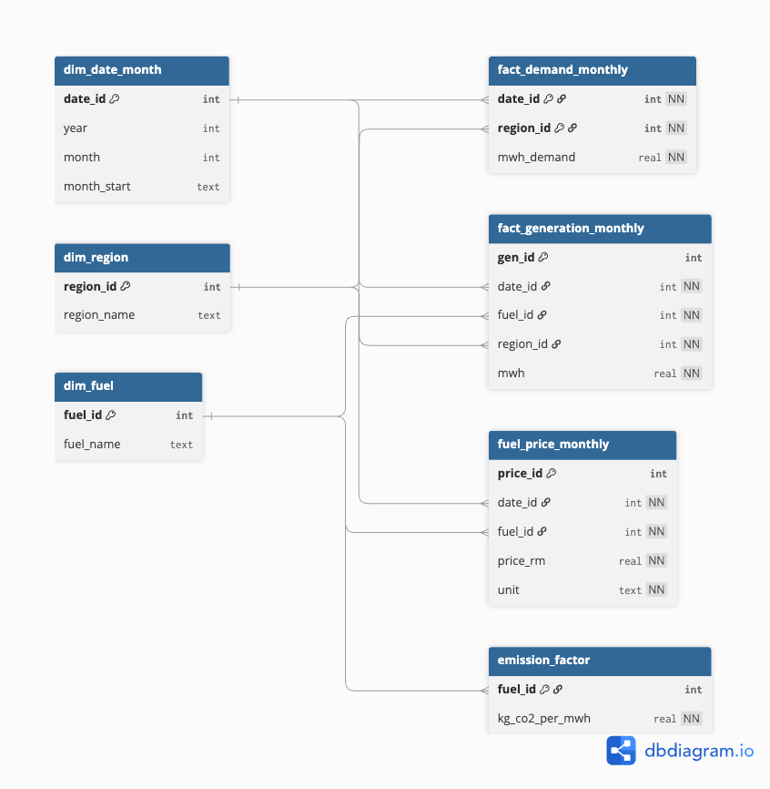
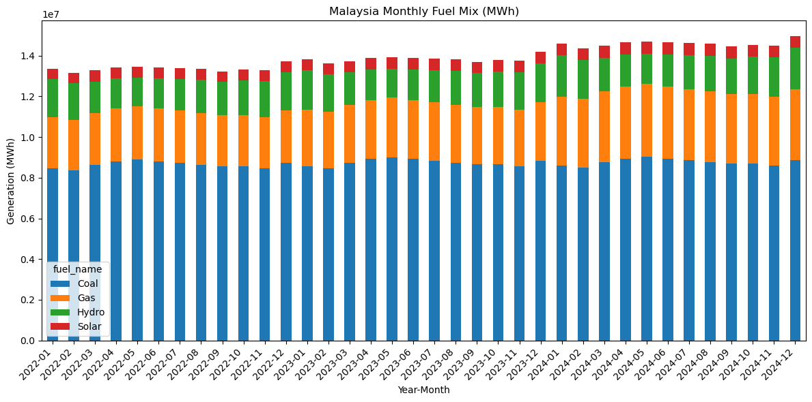
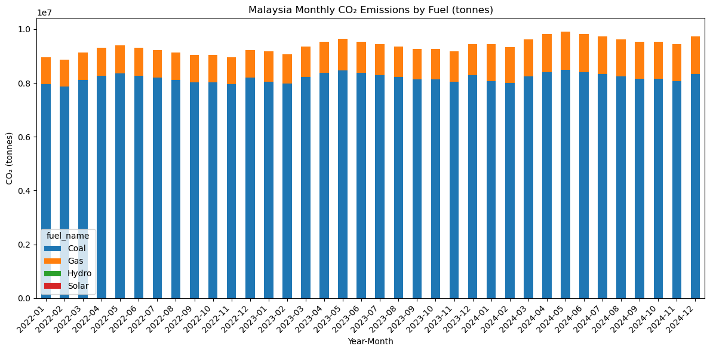
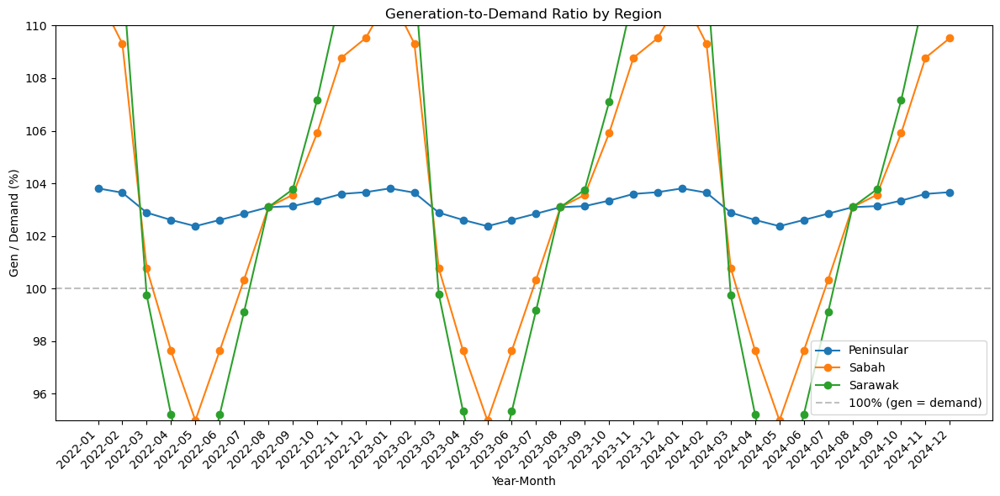

#  Malaysia Power SQL Lab 

A complete SQL + Python analytics project modelling Malaysia’s monthly electricity generation, demand, fuel mix, fuel prices, and CO₂ emissions using a star-schema warehouse built in SQLite + DBCODE.

The dataset for Jan–Jun 2024 is synthetic but realistic, designed to mimic Malaysian power-sector behaviour without relying on proprietary TNB data.

---

## Overview

This repo delivers a full, end-to-end analytical pipeline:

- Star-schema modelling (dimensions + fact tables)
- DDL/DML in DBCODE to build & seed the database
- Analytics SQL views (fuel mix, emissions, generation adequacy)
- Python notebooks generating charts directly from SQLite

---

##  Objectives

- Model Malaysia’s power system using a warehouse-style schema
- Analyze monthly generation, demand, fuel mix, and fuel prices
- Estimate CO₂ emissions using generation × fuel-specific emission factors
- Assess adequacy (generation vs demand by region)
- Produce visual insights using pandas + matplotlib
- Package an end-to-end SQL + analytics project 

---

---

##  Tech Stack

- **SQLite** (lightweight database engine)
- **VS Code** + **DBCODE Notebooks**
- **SQL** (CTEs, joins, views, warehouse structure)
- **Python** (pandas + matplotlib for insights)

---

##  ERD – Star Schema

---

##  Analysis Outputs

Each notebook generates insights directly from the warehouse.

### 1. Fuel Mix (Jan–Jun 2024)

**Summary:**  
Malaysia’s grid is still coal-heavy in this synthetic dataset, with gas providing secondary support and modest contributions from hydro and solar. Seasonal fluctuations appear but base-load dependency remains stable.

---

### 2. CO₂ Emissions by Fuel

**Summary:**  
Emissions trend mirrors the fuel mix: coal dominates CO₂ output, while gas contributes significantly less per MWh. Renewables contribute essentially zero in this dataset, as expected.

---

### 3. Generation-to-Demand Ratio (Adequacy)

**Summary:**  
Peninsular Malaysia shows the highest adequacy margin.  
Sabah & Sarawak trend very closely (due to similar synthetic scaling), maintaining ~24–25% adequacy across months. Peninsular dips early in the year before stabilizing.

---

##  How to Run

1. Open the repo in VS Code
2. Install the DBCODE extension
3. Run:
   - `schema.dbcode` → create tables
   - `seed.dbcode` → insert data
   - `analysis.dbcode` → materialize analytic views
4. Open the Python notebooks and run cells (they read directly from `malaysia_power.db`)

---

##  About the Project

This project was created as a complete SQL + analytics portfolio piece focusing on Malaysia’s power sector.  
It demonstrates skills required for roles in:

- Energy analytics
- SQL engineering
- Data modelling
- Commodity/market analysis
- Reproducible analytical pipelines
