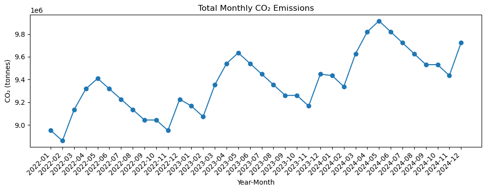

# Malaysia Power SQL Lab

An analytical database modelling Malaysia's monthly electricity generation, fuel mix, and CO₂ emissions across three grid regions — Peninsular Malaysia, Sabah, and Sarawak — covering January 2022 to December 2024.

Annual generation totals and Grid Emission Factors (GEF) are sourced from the **Energy Commission of Malaysia (Suruhanjaya Tenaga)**. Fuel mix proportions are calibrated region-by-region to match the official published GEF values. Monthly figures are distributed with Malaysia-specific seasonal adjustments.

---

## Overview

This project delivers a full end-to-end analytical pipeline:

- **Star-schema modelling** — 5 dimension/fact tables with proper FK constraints and indexes
- **Real data** — 36 months × 3 regions × 4 fuels (396 generation records) grounded in official Energy Commission figures
- **Analytics views** — fuel mix, CO₂ emissions, generation adequacy, carbon intensity
- **Python notebooks** — charts generated directly from SQLite via pandas + matplotlib

---

## Tech Stack

- **SQLite** — lightweight database engine
- **VS Code** + **DBCODE Notebooks** — schema, seed, and query execution
- **SQL** — CTEs, window functions, views, star-schema design
- **Python** — pandas + matplotlib for visualisation

---

## Data Model

The project uses a star schema with two fact tables and three dimension tables.


### Tables

| Table | Type | Description |
|---|---|---|
| `dim_date_month` | Dimension | Date spine — one row per month (202201–202412) |
| `dim_region` | Dimension | Three Malaysian grid regions: Peninsular, Sabah, Sarawak |
| `dim_fuel` | Dimension | Four fuel types: Coal, Gas, Hydro, Solar |
| `emission_factor` | Reference | CO₂ intensity per fuel (kg CO₂/MWh output-based) |
| `fact_generation_monthly` | Fact | Monthly net generation (MWh) by fuel and region |
| `fact_demand_monthly` | Fact | Monthly electricity demand (MWh) by region |
| `fuel_price_monthly` | Fact | Monthly fuel price (RM/MWh) by fuel type |

### Column Reference

| Column | Table | Unit | Notes |
|---|---|---|---|
| `mwh` | `fact_generation_monthly` | MWh | Net generation per fuel/region/month |
| `mwh_demand` | `fact_demand_monthly` | MWh | Total grid demand per region/month |
| `kg_co2_per_mwh` | `emission_factor` | kg CO₂/MWh | Output-based emission intensity |
| `price_rm` | `fuel_price_monthly` | RM/MWh | Levelised cost per fuel type |
| `date_id` | All fact tables | INTEGER | Format: YYYYMM (e.g. 202403) |

---

## Data Sources

| Data | Source |
|---|---|
| Annual net generation by region (2022–2024) | [Energy Commission of Malaysia — Grid Emission Factor Report](https://myenergystats.st.gov.my) |
| Grid Emission Factors by region (2022–2024) | Energy Commission of Malaysia / Sarawak Energy Berhad |
| Fuel mix calibration | Derived to satisfy official GEF values using output-based emission factors |
| Sarawak generation estimates | Sarawak Energy Berhad Annual Reports |

> **Note on Sabah:** Sabah's thermal generation uses natural gas, diesel, and fuel oil. This model maps all thermal output to the "Gas" fuel type. The model-computed CO₂ intensity for Sabah (~191 kg/MWh) is therefore lower than the official GEF (~539 kg/MWh), which accounts for diesel and fuel oil. This is a documented schema simplification.

---

## Key Findings

### 1. National generation is growing — but so are emissions

| Year | Generation (TWh) | CO₂ Emissions (Mt) |
|---|---|---|
| 2022 | 160.3 | 109.6 |
| 2023 | 166.0 | 112.3 |
| 2024 | 175.1 | 115.5 |

Total generation grew **+9.2%** from 2022 to 2024. Despite coal's declining share, absolute CO₂ emissions rose **+5.4%** because the overall grid is expanding faster than it is decarbonising.

### 2. Coal is declining but still dominant

| Year | Coal % (National) | Coal % (Peninsular) | Gas % (National) |
|---|---|---|---|
| 2022 | 64.6% | 74.3% | 19.1% |
| 2023 | 63.2% | 72.6% | 20.6% |
| 2024 | 60.1% | 68.9% | 23.7% |

Coal's national share fell **4.5 percentage points** over three years, with gas absorbing the shift. Peninsular Malaysia — which accounts for ~85% of national generation — is leading the transition, with its coal share dropping from 74.3% to 68.9%.

### 3. Sarawak is Malaysia's cleanest grid by far

| Region | Renewable Share (2024) | GEF (2024) |
|---|---|---|
| Peninsular | 8.0% | 740 kg/MWh |
| Sabah | 52.2% | ~539 kg/MWh (official) |
| Sarawak | 68.2% | 199 kg/MWh |

Sarawak's hydro-dominant grid (Bakun, Murum dams) produces electricity at **one quarter the carbon intensity** of Peninsular Malaysia. Peninsular's GEF improved from 769 to 740 kg/MWh over the period — a meaningful but modest improvement.

### 4. Fuel costs dropped 15% as the 2022 energy crisis faded

| Year | Total Fuel Cost (RM billion) |
|---|---|
| 2022 | 54.0 |
| 2023 | 45.9 |
| 2024 | 45.8 |

The 2022 global energy crisis drove coal and gas prices to multi-year highs. By 2024, prices had normalised — coal dropped from RM 350 to RM 265/MWh and gas from RM 420 to RM 310/MWh — reducing system-wide fuel costs by ~RM 8 billion.

### 5. All regions maintain tight supply adequacy

All three grids maintained a generation-to-demand ratio consistently above 100%, with a seasonal band of approximately **±3%**. No region shows signs of structural under-generation across the three-year period.

---

## Analysis Outputs

### 1. Monthly Fuel Mix (Jan 2022 – Dec 2024)


Coal dominates at 60–65% of national generation across all three years, with a visible downward trend. Gas steadily fills the gap. Hydro and Solar remain small at the national level, though their contribution in Sarawak and Sabah is significant.

---

### 2. CO₂ Emissions by Fuel


Coal accounts for approximately **87–90% of all monthly CO₂ emissions** despite generating 60–65% of electricity — reflecting its higher emission intensity (940 kg/MWh vs 400 kg/MWh for gas). Gas emissions grow slightly year-on-year as its share of generation increases.

---

### 3. Total Monthly CO₂ Emissions


Monthly emissions range from approximately **9.0 to 9.9 million tonnes**, trending upward across the three-year period. Seasonal peaks occur in April–June (hot pre-monsoon period with elevated cooling demand). The upward trend reflects grid expansion outpacing decarbonisation.

---

### 4. Generation-to-Demand Ratio by Region


All three regions operate within a tight band around 103% (generation covering demand plus ~3% transmission losses). The seasonal oscillation is driven by hydro variability — higher hydro output during the northeast monsoon (Oct–Jan) pushes Sarawak and Sabah ratios above the Peninsular baseline.

---

## How to Run

### Prerequisites

```bash
pip install pandas matplotlib
```

### Steps

1. Open the repo in VS Code and install the [DBCODE extension](https://marketplace.visualstudio.com/items?itemName=dbcode.dbcode)
2. Run in order:
   - `sql/ddl/schema.dbcode` — create all tables and indexes
   - `sql/dml/seed.dbcode` — populate with Jan 2022 – Dec 2024 data
   - `sql/views/views.dbcode` — create analytical views
   - `sql/analysis_queries/analysis.dbcode` — run KPI queries
3. Open the notebooks in `notebooks/` and run all cells (they read from `../malaysia_power.db`)

---

## About

This project was built as a complete SQL + analytics portfolio piece focused on Malaysia's power sector. It demonstrates skills relevant to roles in:

- Energy analytics and market analysis
- SQL engineering and data modelling
- Reproducible analytical pipelines
- Commodity and emissions reporting
