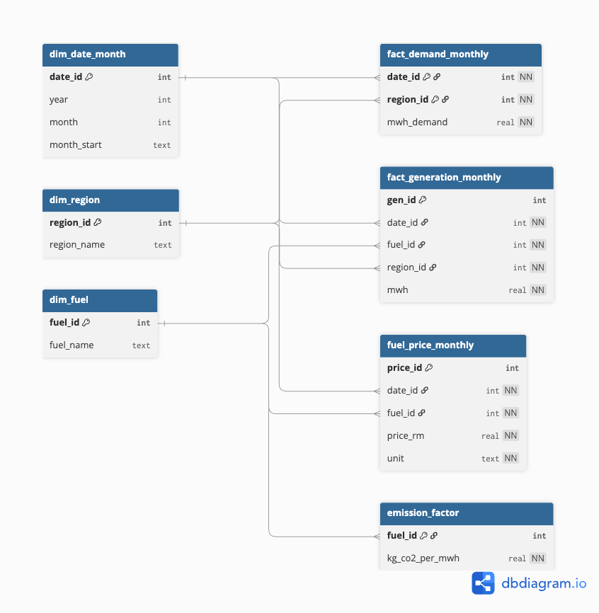
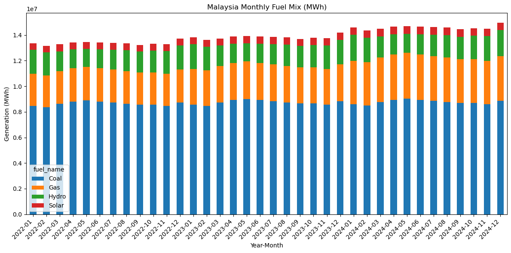
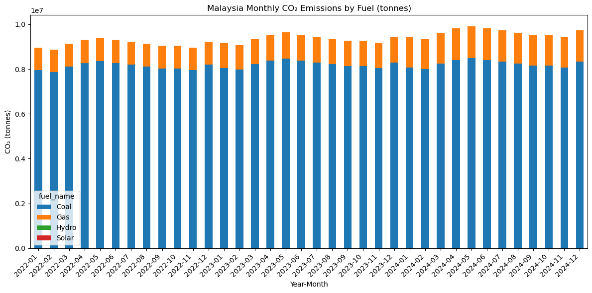
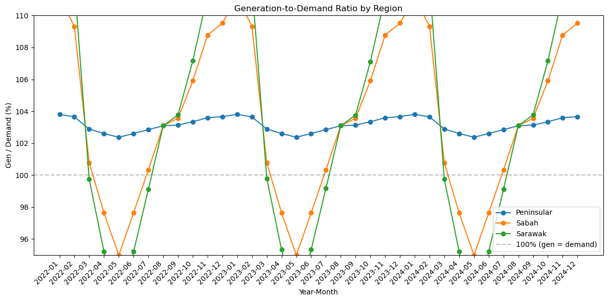

#  Malaysia Power SQL Lab 

This project is an analytical database modelling Malaysia’s monthly electricity generation, fuel mix, and CO₂ emissions across three grid regions (Peninsular, Sabah, Sarawak) for the period Jan 2022 – Dec 2024.

Annual generation totals and Grid Emission Factors are sourced from the **Energy Commission of Malaysia (Suruhanjaya Tenaga)** and distributed monthly with seasonal adjustments. Fuel mix proportions are calibrated to match the official Grid Emission Factors published by the Energy Commission.

The goal: design a clean SQL schema, populate it with real-world-grounded data, create analytical views, and compute KPIs that describe Malaysia’s power sector. Everything is built and queried inside VS Code using the DB Code extension and SQLite.

---

## Overview

This repo delivers a full, end-to-end analytical pipeline:

- Star-schema modelling (dimensions + fact tables)
- DDL/DML in DBCODE to build & seed the database
- **Real data**: 36 months × 3 regions × 4 fuels (396 generation records) grounded in official Energy Commission figures
- Analytics SQL views (fuel mix, emissions, generation adequacy)
- Python notebooks generating charts directly from SQLite

---

##  Objectives

- Model Malaysia’s power system using a warehouse-style schema
- Analyze monthly generation, demand, fuel mix, and fuel prices
- Estimate CO₂ emissions using generation × fuel-specific emission factors
- Assess adequacy (generation vs demand by region)
- Produce visual insights using pandas + matplotlib
- Package an end-to-end SQL + analytics project 

---

---

##  Tech Stack

- **SQLite** (lightweight database engine)
- **VS Code** + **DBCODE Notebooks**
- **SQL** (CTEs, joins, views, warehouse structure)
- **Python** (pandas + matplotlib for insights)

---

## Data Model Overview

The project follows a simple star-schema layout:

1. **dim_month**  
   - Stores `month_id` and `month_name`.  
   - One month → many generation records.

2. **dim_fuel**  
   - Categorizes each generation source (coal, gas, hydro, etc).

3. **emission_factor**  
   - Contains CO₂ emission intensities for each fuel type (kg CO₂ per MWh).  
   - Each fuel has exactly one emission factor.

4. **generation_fact**  
   - The core fact table storing monthly generation (MWh) by fuel type.  
   - Links to both dimension tables via foreign keys.

### Why This Structure is Useful

- **Fuel types can be updated without touching historic generation data.**  
- **Emission factors are reusable across all months.**  
- **The fact table can expand to more months or more fuels.**  
- **Calculations can be pushed into views, keeping facts raw and clean.**  
- **Analysts can join all dimensions to compute KPIs with minimal friction.**

The ERD visualizes these relationships clearly.

 

---
## How the Database is Built

1. **Run `schema.dbcode`**  
   - Creates all dimension tables, fact tables, and keys.

2. **Run `seed.dbcode`**  
   - Populates tables with synthetic values for January–June.

3. **Run `views.dbcode`**  
   - Generates analytical views such as:  
     - Monthly total generation  
     - Monthly emissions  
     - CO₂ intensity per MWh  
     - Fuel-mix percentages  

This process creates a dataset inside `malaysia_power.db`.

##  Analysis Outputs

Each notebook generates insights directly from the warehouse.

### 1. Fuel Mix (Jan–Jun 2024)

**Summary:**  
Malaysia’s grid is still coal-heavy in this synthetic dataset, with gas providing secondary support and modest contributions from hydro and solar. Seasonal fluctuations appear but base-load dependency remains stable.

---

### 2. CO₂ Emissions by Fuel

**Summary:**  
Emissions trend mirrors the fuel mix: coal dominates CO₂ output, while gas contributes significantly less per MWh. Renewables contribute essentially zero in this dataset, as expected.

---

### 3. Generation-to-Demand Ratio (Adequacy)

**Summary:**  
Peninsular Malaysia shows the highest adequacy margin.  
Sabah & Sarawak trend very closely (due to similar synthetic scaling), maintaining ~24–25% adequacy across months. Peninsular dips early in the year before stabilizing.

---

## Data Sources

| Data | Source |
|---|---|
| Annual net generation by region (2022–2024) | [Energy Commission of Malaysia – Grid Emission Factor Report](https://myenergystats.st.gov.my) |
| Grid Emission Factors by region (2022–2024) | Energy Commission of Malaysia / Sarawak Energy Berhad |
| Fuel mix calibration | Derived from official GEF values using IPCC Tier 1 emission factors |
| Sarawak generation estimates | Sarawak Energy Berhad Annual Reports |

> **Note on Sabah:** Sabah's grid runs on natural gas, diesel, and fuel oil. This model maps all thermal generation to the "Gas" fuel type. As a result, the model-computed CO₂ intensity for Sabah (~192 kg/MWh) is lower than the official GEF (~539 kg/MWh), which accounts for diesel and fuel oil. This is a known simplification of the schema.

---

##  How to Run

1. Open the repo in VS Code
2. Install the DBCODE extension
3. Run:
   - `schema.dbcode` → create tables
   - `seed.dbcode` → insert data
   - `analysis.dbcode` → materialize analytic views
4. Open the Python notebooks and run cells (they read directly from `malaysia_power.db`)

---

##  About the Project

This project was created as a complete SQL + analytics portfolio piece focusing on Malaysia’s power sector.  
It demonstrates skills required for roles in:

- Energy analytics
- SQL engineering
- Data modelling
- Commodity/market analysis
- Reproducible analytical pipelines
