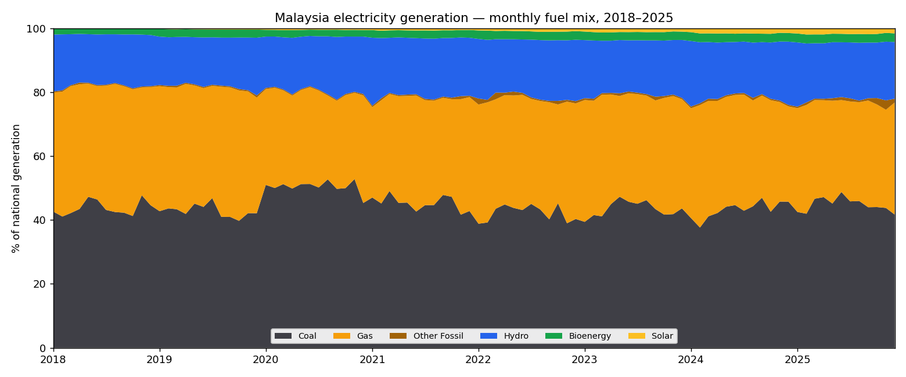
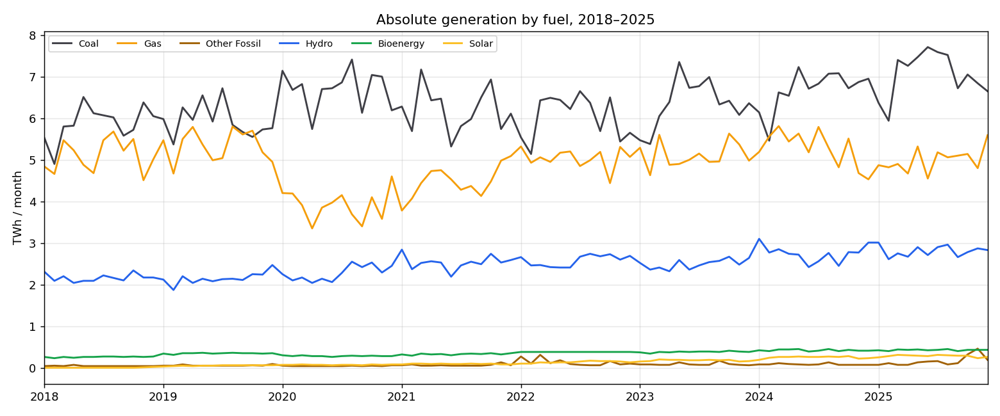
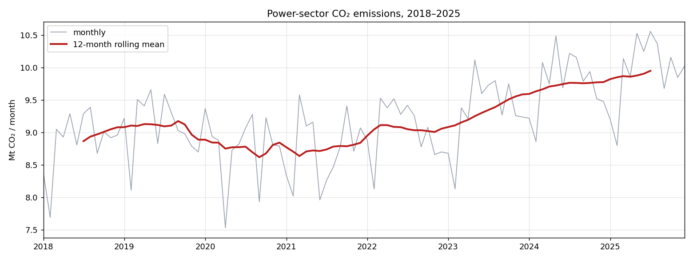
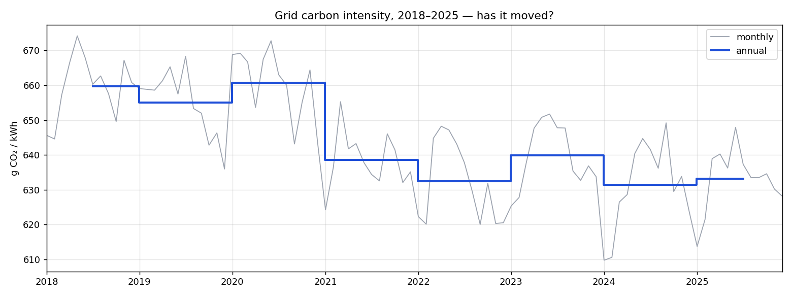
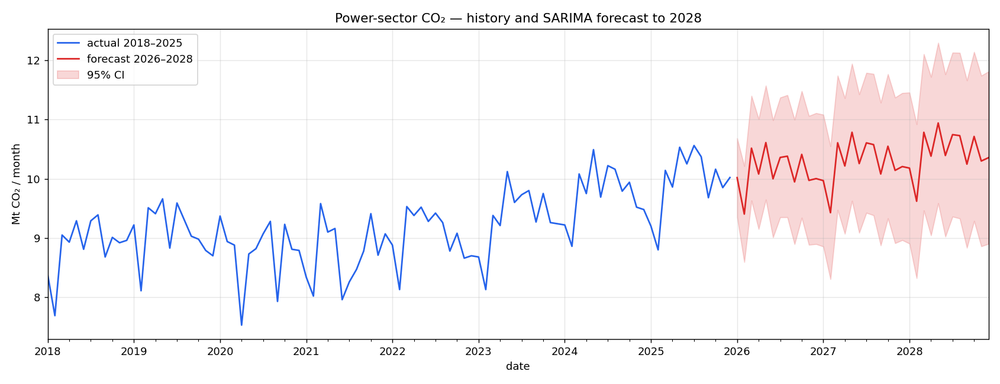

# Malaysia Power SQL Lab
### Is Malaysia Decarbonising? Eight Years of the Power Sector, Month by Month —
### and the Gap Between "the Coal Share Is Falling" and "Emissions Are Falling"

A SQLite warehouse of Malaysia's **monthly** electricity generation by fuel, power-sector CO₂,
demand and carbon intensity — **Jan 2018 to Dec 2025** — built deterministically from a single
real source (Ember's *Monthly Electricity Data*), and used to test the decarbonisation claim
against the data, build a counterfactual, and fit a forecast whose failure mode is the point.

The data is real monthly figures, not annual totals split out by hand: `python scripts/build_db.py`
builds `malaysia_power.db` from the committed slice in `data/sources/ember_malaysia_monthly.csv`,
reconciling it against Ember's reported totals before it writes a row, and every number in this
README is reproduced by running the three notebooks. (One wrinkle, detailed in §4: Ember's monthly
series for Malaysia is real dispatch data for Peninsular — ≈85% of national generation — with the
≈15% Sabah/Sarawak fuel split interpolated from annual figures.)

---

## [1] The Question

The standard line on Malaysia's power sector is that it is decarbonising — coal's share of the
mix is drifting down, solar is coming on, the National Energy Transition Roadmap is in place, a
carbon tax arrives in 2026. This project asks a narrower question that the public reporting
tends to skip: over the years we actually have monthly data for (2018–2025), did Malaysia's
power-sector CO₂ go **down in absolute terms**, and did the **fuel mix** measurably clean up?

It matters because a transition that lowers *intensity* while *absolute emissions keep rising* is
a different risk object — for a lender, an analyst, a regulator — than one that lowers both, and
the difference is exactly what gets lost when "the coal share fell" is reported as "Malaysia is
decarbonising."

## [2] What I Found

**Absolute emissions rose, and the mix barely moved.** Over 2018→2024, national power-sector CO₂
went from **106.4 Mt to 117.2 Mt (+10.2%)**, and **119.4 Mt by 2025 (+12.2%)** — a cumulative
**883 Mt** across the eight years. Generation grew **+17%** over the same span; the grid's carbon
intensity fell only **≈4%** (≈660 → ≈633 g CO₂/kWh). The mix-shift was real but small; the
expansion was not.

**Coal's share didn't fall — coal's tonnage rose.** Coal was **43.7% of national generation in
2018 and 44.8% in 2025** — flat-to-up, not down (with a 2020 spike to ≈50% during the COVID
lockdown). In absolute terms coal generation rose **≈20%** (70.5 → 84.5 TWh). What actually shrank
was **gas**, the *less* carbon-intensive fossil fuel: its share fell from **37.9% to 31.8%**. So
the renewable share that did grow — hydro and bioenergy mostly, plus solar — went up by about
**4 percentage points (18% → 22%)** and substituted for *gas*, while coal held its ground. Solar,
the headline of every transition press release, went from essentially zero to **under 2%** of the
mix.

**The mix-shift, measured, bought about 2%.** A counterfactual that freezes the 2018 fuel mix and
re-applies it to every month since produces ≈19 Mt *more* CO₂ over 2018–2025 than what actually
happened — i.e. all the mix variation of the last eight years netted out to roughly a 2% cut on
the cumulative total. Pushing harder — serving all generation growth since 2018 with zero-carbon,
or redispatching half of coal to gas — buys ≈5% and ≈8% respectively. Section 5 has the numbers;
none of them is a feasible-pathway claim.

**A forecast that's worth less than its error bars.** A SARIMA model on the real 96-month series
projects emissions drifting up to **≈125 Mt by 2028**, with a 95% interval that's genuinely wide
(≈[109, 142]). The point of the forecast notebook isn't that number — it's that the backtests run
at **5–7% error** and visibly miss the 2020 COVID dip and the 2024 demand surge, which is what
historical-trend extrapolation does on a real grid heading into a structural transition.

## [3] Why This Project

I started from the shorthand most people use — coal share down, therefore emissions down — and
went looking for the chart that showed it. The chart showed a coal share that's basically flat, a
grid that's bigger every year, and an emissions line that ticks up. The project turned into an
investigation of that gap: how much has the mix actually changed, what would close the rest, and
what does a naive forecast miss? The SQL warehouse and the notebooks are apparatus; the project is
the question and the discipline of only using data I can stand behind.

That discipline cost some scope. There is no public **monthly, by-fuel, by-region** series for
Malaysia, and no real free **fuel-price** series, so this is a *national* analysis with no cost
dimension — see §7. What it gains in exchange: nothing in it is invented.

## [4] Data & Method

Source: **Ember, *Monthly Electricity Data* (Malaysia)** — monthly generation by fuel (Coal, Gas,
Hydro, Solar, Bioenergy, Other Fossil; TWh and %), total generation, demand, net imports,
power-sector CO₂ by fuel and total, and CO₂ intensity, Jan 2018 – Dec 2025 (CC-BY-4.0). The
committed file `data/sources/ember_malaysia_monthly.csv` is the Malaysia rows of that release;
`scripts/build_db.py` builds the database from it and runs reconciliation checks (per-fuel sums
match Ember's reported monthly totals; implied intensity matches Ember's reported intensity). Full
lineage: [`data/sources/SOURCES.md`](data/sources/SOURCES.md).

What sits behind Ember's Malaysia series, from their published methodology: annual generation comes
from the Energy Institute; **monthly generation by fuel for Peninsular Malaysia — ≈85% of national
output — is taken from the Grid System Operator** (real dispatch data); monthly *total* generation
for Sabah and Sarawak (≈15%) is from the Department of Statistics, with the fuel split for those
two regions disaggregated from their annual figures (i.e. interpolated); net imports are from the
EIA. So this is mostly real monthly dispatch data, with the Sabah/Sarawak fuel mix the one
interpolated piece — and because Ember reconciles and projects, its monthly values don't sum
exactly to its annual figures, which is why `build_db.py` reconciles against the reported *monthly*
totals. Ember's per-fuel CO₂ factors are applied by fuel (the gas factor accounts for combined heat
and power, part of why it sits above a textbook CCGT).

Schema (SQLite, star-ish):

| Table | Grain | Contents |
|---|---|---|
| `dim_month` | month | `month_id` (YYYYMM), year, month, month_start — 201801…202512 |
| `dim_fuel` | fuel | Coal, Gas, Other Fossil, Hydro, Bioenergy, Solar (Ember's 6 buckets) |
| `fact_generation_monthly` | month × fuel | `twh`, `share_pct` |
| `fact_emissions_monthly` | month × fuel | `mtco2` (Ember's power-sector CO₂) |
| `fact_demand_monthly` | month | `demand_twh`, `net_imports_twh` |
| `fact_summary_monthly` | month | Ember's reported `total_gen_twh`, `total_emissions_mtco2`, `co2_intensity_g_per_kwh` — kept verbatim as a cross-check |
| views | — | `v_generation_enriched`, `v_fuel_mix`, `v_monthly_emissions`, `v_annual`, `v_implied_emission_factor` |

There is no `emission_factor` table — Ember reports CO₂ per fuel directly. The view
`v_implied_emission_factor` derives the period-average intensity per fuel (Coal ≈0.90, Gas ≈0.67,
Other Fossil ≈0.72, Bioenergy ≈0.23, Hydro ≈0.024, Solar ≈0.036 tCO₂/MWh) — used in the
counterfactual, and flagged in §9 because Ember's gas figure is higher than a textbook CCGT.

**Design choices & tradeoffs.** *Why a star-ish schema* over one flat table: avoids update
anomalies (one place to fix a fuel attribute) and lets generation, emissions and demand extend
independently; the analysis is join-heavy anyway. *Why monthly grain*: it's the finest grain the
source supports — and unlike the prior version of this project, which interpolated monthly figures
from annual totals, here the monthly data is actually monthly. *Why national*: the
Peninsular/Sabah/Sarawak split is published only annually (Energy Commission handbooks); a monthly
regional table would have to be estimated, so it's out. For the record, the Commission's published
2024 Grid Emission Factors put Peninsular's grid around **≈740 g CO₂/kWh** and Sarawak's, on hydro,
around **≈199** — a real geographic asymmetry, just one this national dataset can't animate.

The descriptive notebook (`notebooks/01_overview.ipynb`) produces:






## [5] Counterfactual Analysis

[`notebooks/02_counterfactual.ipynb`](notebooks/02_counterfactual.ipynb) holds each month's *real*
total generation constant and only re-slices it across fuels:

| Scenario | Definition |
|---|---|
| `Baseline` | observed mix and emissions, 2018–2025 |
| `FrozenMix2018` | every month re-sliced by 2018's annual fuel-mix shares — "what did the mix-shift so far actually buy?" |
| `GrowthServedClean` | each fossil fuel held at its 2018 same-calendar-month generation; all generation growth since served by zero-carbon — an upper-bound flavour |
| `CoalHalvedToGas` | 50% of each month's coal generation reassigned to gas — a near-term redispatch lever (the gas plants exist) |

Cumulative power-sector CO₂ over the eight years (re-sliced scenarios use each fuel's *implied*
intensity from Ember's data, not assumed factors):

| Scenario | Cumulative CO₂ (Mt) | vs Baseline (Mt) | Value of the difference @ RM 20/t | @ RM 50/t |
|---|---:|---:|---:|---:|
| Baseline | 883.2 | — | — | — |
| FrozenMix2018 | 902.1 | **−18.9** (the mix-shift *saved* this much) | RM 0.4 bn | RM 0.9 bn |
| GrowthServedClean | 837.2 | 46.0 avoided | RM 0.9 bn | RM 2.3 bn |
| CoalHalvedToGas | 814.9 | 68.3 avoided | RM 1.4 bn | RM 3.4 bn |


Two prices are quoted because two are relevant: **RM 20/t** is the low end of published projections
for Malaysia's 2026 carbon tax on the iron, steel and energy industries (the rate was not gazetted
as of writing — see `SOURCES.md`); **RM 50/t** is the floor price of the first nature-based carbon
credit auction on the Bursa Carbon Exchange (Kuamut Rainforest, July 2024). Neither is a
market-clearing price; both bracket the order of magnitude.

The honest reading: `FrozenMix2018` says the fuel-mix change of the last eight years was worth
roughly **−19 Mt, about 2% of cumulative emissions** — small, and not monotonic (2020's coal-heavy
COVID year ran *dirtier* than a frozen-2018 mix would have). `CoalHalvedToGas` looks like a weak
lever — only ≈8% — partly because Ember's gas intensity (≈0.67 tCO₂/MWh) is well above a textbook
CCGT, so switching coal to gas on these numbers doesn't buy what the usual comparison suggests.
`GrowthServedClean` is an upper bound, not a pathway: it assumes every extra MWh since 2018 was
zero-carbon, with no capacity, storage, transmission or cost modelling. The notebook carries the
full caveat list.

## [6] Forecast Model

[`notebooks/03_forecast.ipynb`](notebooks/03_forecast.ipynb) fits **SARIMA(1,1,1)(1,1,1,12)** to
the 96-month national CO₂ series — `d=1` for trend, `D=1, s=12` for the annual pattern, AR(1)/MA(1)
and one seasonal AR/MA term for residual structure. With 96 observations the order is comfortably
identifiable; it's fixed rather than searched, on purpose.

Two backtests:

| Backtest | Train | Test | MAPE | RMSE | Bias |
|---|---|---|---:|---:|---:|
| 1 — in-distribution | 2018–2023 | 2024 | 5.2% | 0.58 Mt | −0.50 Mt |
| 2 — across the 2020 break | 2018–2019 | 2020 (COVID) | 6.8% | 0.71 Mt | +0.10 Mt |


Retrained on the full series, the forward forecast (95% CI):

| Year | Forecast CO₂ (Mt) | 95% CI |
|---|---:|---|
| 2026 | 121.7 | [110.1, 133.3] |
| 2027 | 123.4 | [109.3, 137.5] |
| 2028 | 125.4 | [108.9, 141.8] |



Neither backtest blows up, but both miss real structural movements. Backtest 1 *under-predicts*
2024 by about half a megatonne a month — it didn't see the demand surge (data-centre load ramping)
that pushed 2024 generation up nearly 6% on 2023. Backtest 2 carries the 2018–19 trend straight
through the 2020 lockdown, missing the April–June dip; at the annual level the miss mostly washes
out, which is itself the lesson — a structural break can be invisible in annual aggregates and
still be there in the months. So the 5–7% errors are the honest accuracy of trend extrapolation on
a real grid, an order of magnitude worse than the same model looks on a smooth synthetic series,
and the gap is where the structural shocks live. The forecast to 2028 is worth less than that gap:
Malaysia's power system has the 2026 carbon tax, the NETR, fast-growing data-centre load and EV
adoption ahead of it, and a model trained on historical aggregates treats every one of those as
noise until after the fact. A scenario-conditioned model — policy choices as *inputs* — is the
right next instrument, not a better-tuned extrapolation.

## [7] What I Tried That Didn't Work

1. **Predicting the fuel mix from macro drivers.** I regressed the monthly national coal share on
   demand, calendar-month dummies and a linear trend (appendix in `02_counterfactual.ipynb`).
   Demand alone explains essentially nothing (**R² ≈ 0.01** — the coal *share* doesn't track load;
   coal is near-baseload and the swings get absorbed elsewhere). Season + trend only reach **R² ≈
   0.18**, leaving ~80% of the month-to-month coal share as idiosyncratic — plant outages, hydro
   availability, gas supply, dispatch quirks — and the trend term comes out **not statistically
   distinguishable from zero**. There is no measurable downward trend in the coal share over
   2018–2025, and no tidy macro story behind it. Lesson: a generation mix isn't a smooth function
   of observable drivers — it's a lumpy fleet whose monthly output is dominated by outages and
   resource availability, and the policy signal, if it's in there at all, is below the noise floor.
2. **Wanting the Energy Commission's own monthly data, and a regional split.** Neither is published
   — the Commission reports generation by fuel and by region *annually*; the Single Buyer publishes
   only Peninsular Malaysia, as dispatch reports that would have to be scraped. So this is a
   national analysis on Ember's reconstructed monthly series. Lesson: scope the analysis to the
   data that exists, not the data you wish existed.
3. **Wanting fuel prices.** There is no real, free, Malaysia-specific monthly fuel-price series;
   global benchmarks (Newcastle coal, JKM LNG) aren't what TNB actually pays. Rather than dress a
   benchmark series up as Malaysian procurement cost, I cut the cost dimension entirely. Lesson: an
   honest "we don't have that" beats a plausible-looking proxy.

## [8] Implications for Energy-Sector Risk Analysis

This project produces data that *points toward* a few questions; it does not answer them, and it
names no specific bank, regulator or central bank.

1. **Stranded-asset risk in Peninsular coal.** Peninsular Malaysia's coal fleet — Manjung, Jimah,
   Tanjung Bin, Kapar, Jimah East, on the order of 12 GW combined — has design lives in the
   15–25-year range; under any 2050 net-zero pathway those plants retire well before their
   accounting end-of-life, and the data here shows coal generation *rising* in absolute terms, not
   winding down. The questions that follow — which lenders hold the project-finance debt, how the
   maturity profiles line up against plausible retirement windows, whether the exposure is
   reflected in capital-adequacy frameworks — are answerable and important; this project doesn't
   answer them, it just shows the trend they sit on.
2. **Trend extrapolation under-prices transition risk.** §6 is a concrete small example: a forecast
   that treats policy and demand shocks as noise will, by construction, miss the transition — and a
   climate stress test built that way inherits the blind spot. Scenario-conditioned models are the
   needed instrument.
3. **Concentration.** The hard, slow, expensive part of the transition is concentrated in
   Peninsular Malaysia, which carries most of the load and most of the coal — i.e. transition risk
   concentrates where decarbonisation is structurally hardest, which is also where the financial
   exposure is largest.

## [9] Limitations & Known Gaps

| Limitation | Effect |
|---|---|
| Ember is a secondary source, not the primary Energy Commission record. For Malaysia the monthly series is real dispatch data for Peninsular (≈85% of generation, from the Grid System Operator) but the Sabah/Sarawak fuel split (≈15%) is interpolated from annual figures; and Ember's monthly values don't sum exactly to its own annual figures | The monthly fuel mix is roughly 85% metered / 15% interpolated — a strong secondary source, not the primary record |
| National only — no Peninsular/Sabah/Sarawak breakdown in the released data | The geographic asymmetry (Peninsular vs hydro-heavy Sarawak) is mentioned but not modelled here; the regional split is published only annually |
| Per-fuel CO₂ intensities are Ember's accounting, carried through as-is (gas ≈0.67 tCO₂/MWh — above a textbook CCGT, partly because Ember's gas factor accounts for combined heat and power; small non-zero figures for hydro/bioenergy) | Makes coal→gas switching look like a weaker emissions lever in the counterfactual than the usual comparison implies |
| SARIMA forecast assumes a stable data-generating process | Can't capture the 2026 carbon tax, the NETR, data-centre load or EV adoption — and the backtests show 5–7% error and visible misses on 2020 and 2024 |
| Counterfactual changes only the fuel mix, holding generation constant | No capacity, storage, transmission, retirement, demand-response or capital-cost modelling; `GrowthServedClean` in particular is an upper bound, not a pathway |

## [10] Reproducibility

The database is derived from a committed source file by a committed script:
`python scripts/build_db.py` reads `data/sources/ember_malaysia_monthly.csv`, builds the schema and
views, loads the data, and asserts it reconciles with Ember's reported totals before writing
`malaysia_power.db`. Every number in this README is reproduced by running the three notebooks; the
charts are written to `outputs/`. Lineage and licences: [`data/sources/SOURCES.md`](data/sources/SOURCES.md).

Honest residual: Ember is a well-documented *secondary* source, not the primary Energy Commission
record. For Malaysia the monthly series is real dispatch data for Peninsular (≈85% of generation,
from the Grid System Operator) with the Sabah/Sarawak fuel split (≈15%) interpolated from annual
figures (see §4 and §9), and Ember's monthly values don't sum exactly to its annual figures. That's
the boundary of the ground truth here.

## [11] How to Run

```bash
pip install -r requirements.txt          # pandas, matplotlib, statsmodels, numpy
pip install nbconvert                     # only if running the .ipynb files headlessly

python scripts/build_db.py                # builds malaysia_power.db from the committed Ember slice

jupyter nbconvert --to notebook --execute --inplace notebooks/01_overview.ipynb
jupyter nbconvert --to notebook --execute --inplace notebooks/02_counterfactual.ipynb
jupyter nbconvert --to notebook --execute --inplace notebooks/03_forecast.ipynb
```

(`malaysia_power.db` is also committed for convenience, so the notebooks run without the build step.
DBCODE alternative: open the repo in VS Code with the
[DBCODE extension](https://marketplace.visualstudio.com/items?itemName=dbcode.dbcode) and run
`sql/ddl/schema.dbcode` → load via `scripts/build_db.py` → `sql/views/views.dbcode` →
`sql/analysis_queries/analysis.dbcode`.)
