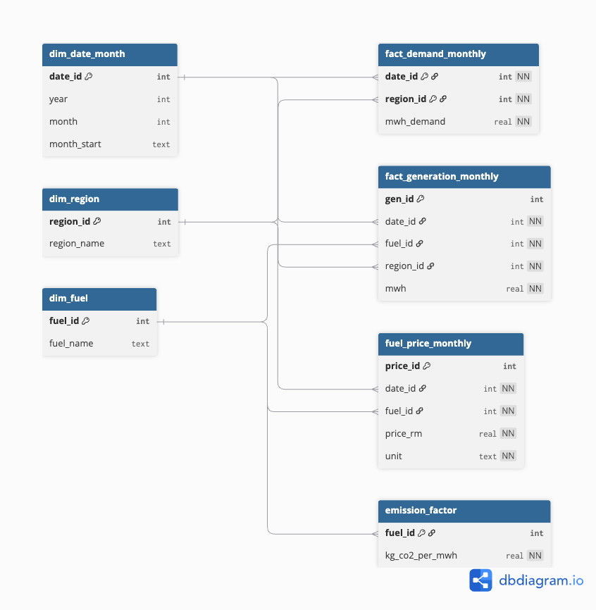
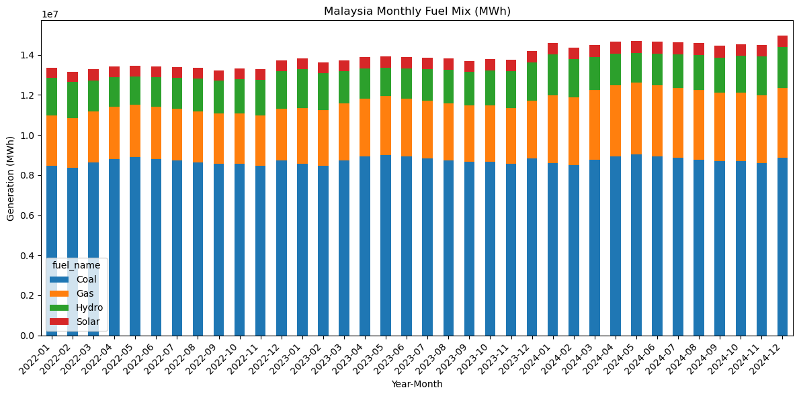
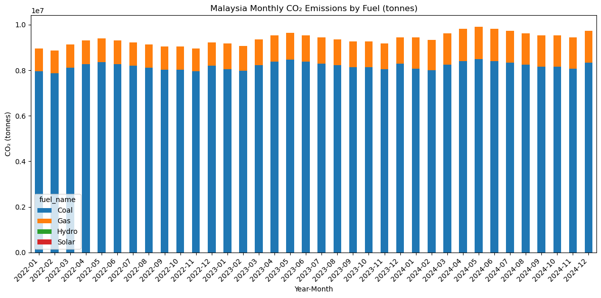
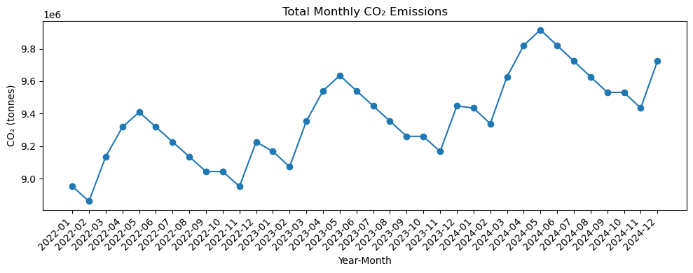
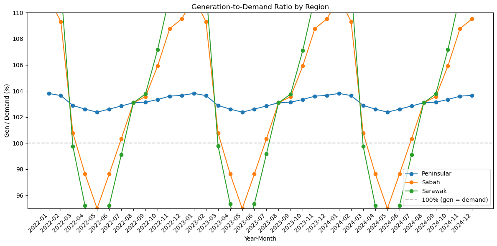
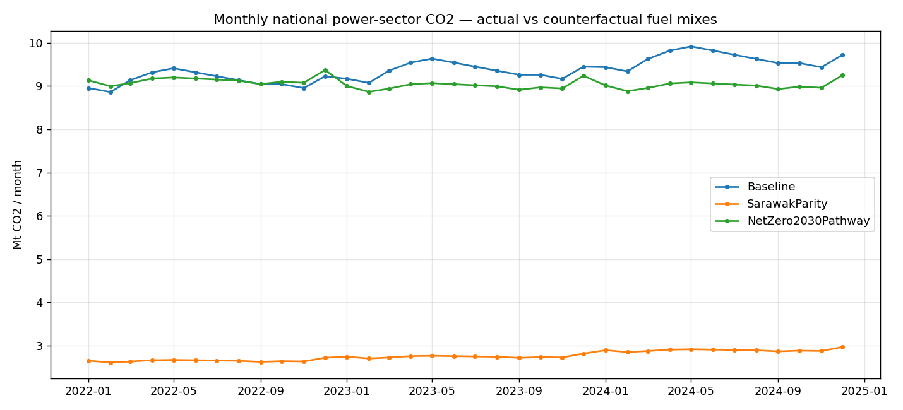
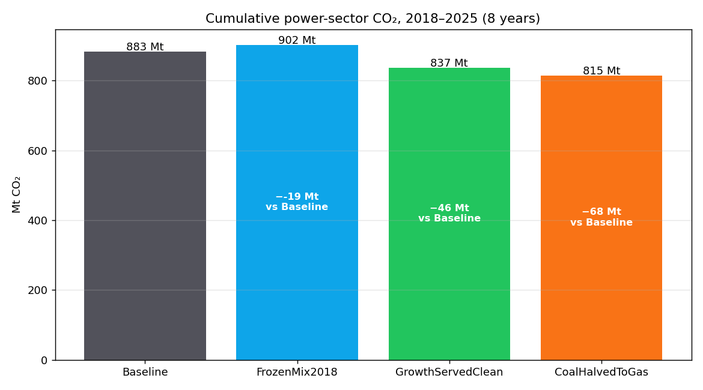
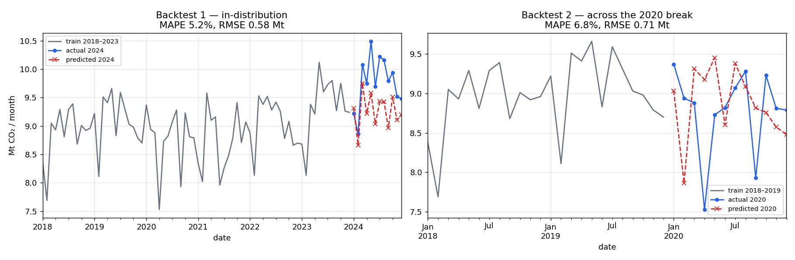
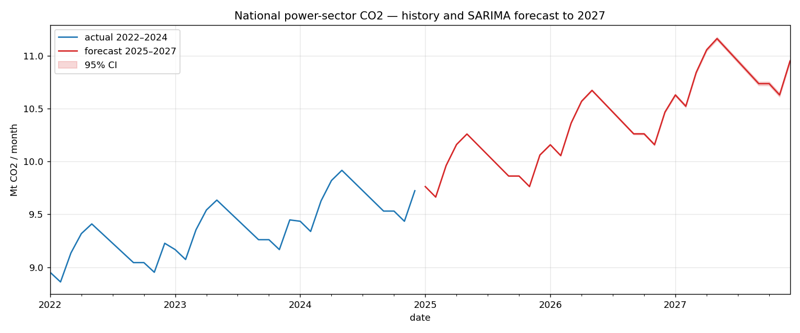

# Malaysia Power SQL Lab
### Is Malaysia Actually Decarbonising? A Three-Year Investigation into the
### Gap Between Fuel-Mix Transition and Absolute Emissions

A SQLite data warehouse of Malaysia's monthly electricity generation, fuel mix, fuel
cost and CO₂ emissions — Peninsular Malaysia, Sabah and Sarawak, January 2022 to
December 2024 — used to test one claim against the data, build a counterfactual, and
fit a forecast whose failure mode is the point.

---

## [1] The Question

The standard line on Malaysia's power sector is that it is decarbonising: coal's share
of the generation mix is falling, gas and solar are rising, the National Energy
Transition Roadmap is in place, and a carbon tax arrives in 2026. All of that is true
as far as it goes.

But "the coal share is falling" and "emissions are falling" are different statements,
and in a grid that is also growing they can point in opposite directions. This project
asks the second question directly: over 2022–2024, did Malaysia's power-sector CO₂ go
down in absolute terms? The answer matters to anyone modelling transition risk — a
lender, an analyst, a regulator — because a transition that reduces *intensity* while
*absolute emissions keep rising* is a different risk object than one that reduces both.

## [2] What I Found

**Absolute emissions rose.** National power-sector CO₂ went from **109.6 Mt in 2022 to
115.5 Mt in 2024 — up 5.4%** — for a three-year total of **337 Mt**. Over the same
period generation grew **+9.2%** (160.3 → 175.1 TWh) and the grid's carbon intensity
fell only **−3.5%** (≈684 → ≈660 kg CO₂/MWh). The decarbonisation of the *mix* was
real but less than half the size of the *expansion*, so the level went up.

**Coal's share fell; coal's tonnage did not.** Coal dropped from **64.6% to 60.1%** of
the national mix — but in absolute MWh, coal generation still rose slightly (103.6 →
105.2 TWh, +1.6%). The growth in demand was met mostly by gas (30.7 → 41.5 TWh,
+35.5%); the new gas went *on top of* coal, not in place of it. That is the gap between
the narrative and the data in one sentence.

**The transition is geographically lopsided.** In 2024, Peninsular Malaysia (≈85% of
national generation) ran at a carbon intensity around **740 kg/MWh**; Sarawak, on
hydro, around **199 kg/MWh** — roughly one quarter. Decarbonisation is structurally
easy where it has already happened and structurally hard where most of the load is.

**Counterfactual.** Holding each region's total generation fixed and only re-slicing
the fuel mix: applying Sarawak's 2024 mix everywhere would have cut cumulative
2022–2024 emissions from 337 Mt to **99 Mt** (≈238 Mt avoided); a partial glide along a
"net-zero-by-2030" pathway, realised only for its first two years, avoids about **12
Mt**. The first number is an upper bound on what fuel-mix change *alone* could do — it
is not a feasible pathway (Sabah has no hydro capacity to speak of); the second shows
how little of a long glide is realised early. Both are quantified in Section 5.

**Forecast.** A SARIMA model trained on 2022–2024 extrapolates to roughly **120 / 124 /
130 Mt** for 2025 / 2026 / 2027 — i.e. business-as-usual keeps the level rising. The
more useful output of that exercise is *not* those numbers (see Section 6 for why) but
the demonstration that a historical-trend model cannot see the policy and demand shifts
that will actually move the series.

## [3] Why This Project

I started from the same shorthand most people use — coal share is down, therefore
emissions are down — and went looking for the chart that showed it. The chart showed
the opposite: a mix that is slowly greening, a grid that is growing faster, and an
emissions line that ticks up every year. The project turned into an investigation of
that gap: how big is it, what would close it, and what does a naive forecast miss?

The SQL warehouse, the views, the notebooks — that is apparatus. The project is the
question and the honesty about the answer's limits. Where the data is interpolated or a
scenario is stylised, this README says so rather than rounding it off.

## [4] Data & Method

The model is a star schema in SQLite (`malaysia_power.db`):

| Table | Type | Description |
|---|---|---|
| `dim_date_month` | dimension | one row per month, 202201–202412 |
| `dim_region` | dimension | Peninsular, Sabah, Sarawak |
| `dim_fuel` | dimension | Coal, Gas, Hydro, Solar |
| `emission_factor` | reference | output-based kg CO₂/MWh per fuel (Coal 940, Gas 400, Hydro 0, Solar 0) |
| `fact_generation_monthly` | fact | net generation (MWh) by month × region × fuel — 36 × 3 × 4 = 396 rows |
| `fact_demand_monthly` | fact | grid demand (MWh) by month × region |
| `fuel_price_monthly` | fact | levelised fuel cost (RM/MWh) by month × fuel |

Annual generation totals and Grid Emission Factors come from the **Energy Commission of
Malaysia (Suruhanjaya Tenaga)**, with Sarawak figures cross-checked against Sarawak
Energy Berhad disclosures. The region-by-region fuel mix is calibrated so the
model-computed GEF matches the published GEF. Monthly figures are the annual totals
distributed with a Malaysia-specific seasonal adjustment. The fuel-price series is a
stylised levelised-cost assumption, not a measured price feed. Full lineage:
[`data/sources/SOURCES.md`](data/sources/SOURCES.md).



### Design choices & tradeoffs

- **Why a star schema** rather than one flat denormalised table: the alternative was
  considered and rejected. A flat table re-stores region and fuel attributes on every
  row (storage, but more importantly update anomalies — change an emission factor and
  you have to find every row), and it makes the fact tables harder to extend
  independently. The star schema costs a few joins; the analysis is join-heavy anyway.
- **Why monthly grain** and not daily: the source reporting is annual, occasionally
  quarterly — there is no public daily series to ground a daily table in, and the
  consumers of this kind of analysis (transition-risk reporting, regulatory cycles) work
  in months and years, not days. Daily grain would be precision the data can't support.
- **Sabah, modelled as pure gas.** Sabah's thermal fleet runs natural gas, diesel and
  fuel oil; this model maps all of it to "Gas". The honest consequence: the
  model-computed Sabah carbon intensity (~191 kg/MWh) is well *below* the official GEF
  (~539 kg/MWh), which prices in the diesel and fuel oil. Sabah is ~4% of national
  generation, so this does not move the national totals much, but any Sabah-specific
  figure here is understated and labelled as such.

The existing exploratory notebooks (`notebooks/fuel_mix.ipynb`,
`notebooks/emmisions.ipynb`, `notebooks/efficiency_baseload.ipynb`) produce the
descriptive charts below:






## [5] Counterfactual Analysis

[`notebooks/04_counterfactual.ipynb`](notebooks/04_counterfactual.ipynb) holds each
region's *total* monthly generation exactly as observed and only redistributes it across
the four fuels under three scenarios:

| Scenario | Coal | Gas | Hydro | Solar | Definition |
|---|---|---|---|---|---|
| `Baseline` | actual | actual | actual | actual | the observed 2022–2024 mix |
| `SarawakParity` | 13% | 19% | 65% | 3% | Sarawak's 2024 mix, applied to every region |
| `NetZero2030Pathway` | 64.6→30% | 19.1→35% | 13.5→25% | 2.8→10% | a linear glide 2022→2030 of the national mix; only the 2022–2024 portion is realised |

Cumulative power-sector CO₂ over the three years:

| Scenario | Cumulative CO₂ (Mt) | Avoided vs Baseline (Mt) | Value of avoided tonnes @ RM 20/t | @ RM 50/t |
|---|---:|---:|---:|---:|
| Baseline | 337.4 | — | — | — |
| SarawakParity | 99.4 | 238.0 | RM 4.8 bn | RM 11.9 bn |
| NetZero2030Pathway (partial) | 325.9 | 11.5 | RM 0.2 bn | RM 0.6 bn |




Two prices are quoted because two are relevant: **RM 20/tonne** is the low end of
published projections for Malaysia's 2026 carbon tax on the iron, steel and energy
industries (the rate was not gazetted as of writing — see `SOURCES.md`); **RM 50/tonne**
is the floor price set for the first nature-based carbon credit auction on the Bursa
Carbon Exchange (Kuamut Rainforest, July 2024), a voluntary-market reference. Neither is
a market-clearing price; both bracket the order of magnitude.

**`SarawakParity` is an upper bound, not a recommendation.** It assumes every region can
suddenly run on 65% hydro, which Peninsular Malaysia cannot without on the order of 15 GW
of new build, and which Sabah cannot at all. It is there to size the maximum that
fuel-mix change *by itself* could deliver — about a 70% cut — against which the realised
trend (a few percent of intensity improvement) and the partial net-zero glide (≈12 Mt
over two years) can be read. The notebook carries the full caveat list as its last cell.

## [6] Forecast Model

[`notebooks/05_forecast.ipynb`](notebooks/05_forecast.ipynb) fits
**SARIMA(1,1,1)(1,1,1,12)** to the 36-point monthly national CO₂ series: one regular
difference for trend, one seasonal difference at lag 12 for the annual pattern, and an
AR(1)/MA(1) pair plus one seasonal AR/MA term for residual structure. With only 36
observations there is not enough data for a careful order search, so the order is fixed
and what it does is reported — including where it breaks.

Two backtests, with different jobs:

| Backtest | Train | Test | MAPE | RMSE | Bias |
|---|---|---|---:|---:|---:|
| 1 — in-distribution | 2022–2023 | 2024 | 0.40% | 0.04 Mt | −0.04 Mt |
| 2 — stress (H2 2024) | 2022 – Jun 2024 | Jul – Dec 2024 | 0.27% | 0.03 Mt | +0.03 Mt |



Retrained on the full series, the forward forecast (95% CI) is:

| Year | Forecast CO₂ (Mt) | 95% CI |
|---|---:|---|
| 2025 | 119.5 | [119.5, 119.6] |
| 2026 | 124.4 | [124.3, 124.4] |
| 2027 | 130.1 | [129.9, 130.3] |



Read those error bars with suspicion. Backtest 2 was *designed* to expose regime-change
blindness — train through a structural shift, test after it — but this dataset's monthly
series is interpolated from annual totals with a fixed seasonal shape, so there is no
real break for the model to miss, and both backtests come out near-perfect. A sub-0.5%
MAPE and a CI you could measure with a ruler are not a sign the model is good; they are a
sign the series is too smooth. Real monthly emissions are messier than this.

So the forecast's value is not its central estimate. It is the structural point: a
SARIMA model treats the data-generating process as stable, and Malaysia's energy system
is not — capacity additions, the 2026 carbon tax, the National Energy Transition
Roadmap, and new demand from data centres and EVs are all coming, and a model trained on
historical aggregates will read every one of them as noise after the fact. The correct
next step is a scenario-conditioned model that takes policy choices as *inputs*, not a
better-tuned extrapolation.

## [7] What I Tried That Didn't Work

Three approaches I weighed and set aside, and why — because the reasons are the part
worth keeping:

1. **Predicting the fuel mix from macro drivers** — I regressed the monthly national coal
   share on demand, the coal price and the gas price (the appendix in
   [`notebooks/04_counterfactual.ipynb`](notebooks/04_counterfactual.ipynb)). In levels it
   fits almost perfectly — **R² ≈ 0.95** — which looks like a vindication of the behavioural
   "cheap gas displaces coal" story until you read the coefficients: the coal-price and
   gas-price terms come out almost exactly equal and opposite (≈ −0.0037 and +0.0036), the
   collinearity tell of two regressors that, in this dataset, are little more than a year
   label (the price series is constant within each calendar year). They proxy the downward
   trend; they do not measure a price response. Strip the trend — first-difference
   everything — and the only regressor with genuine within-year variation, the demand
   change, explains about **9%** of the month-to-month movement in the coal share. (Adding
   the price changes back in lifts that to 0.77, but only because they flag the two
   year-boundary months where the share steps — a dummy, not a driver.) The mix doesn't
   behave like a market clearing on fuel economics; it behaves like a fixed fleet dispatched
   against load. Two lessons: model the constraint and the load, not the fuel price; and be
   suspicious of a regressor — like this coarse price series — that is really "time" in a
   costume.
2. **Back-calculating the regional fuel mix from the national GEF.** Going the other way
   — infer the three regions' mixes from one published national emission factor — is an
   underdetermined system: one equation, twelve unknowns (4 fuels × 3 regions). You can
   fit it, but you've chosen the answer, not recovered it. Lesson: top-down inference
   can't reconstruct bottom-up granularity without more constraints; source-level data
   beats a reconstructed aggregate, which is why the model is calibrated region by region
   instead.
3. **Daily granularity.** Tempting for the forecast, but the source reporting is annual
   (sometimes quarterly), and the audience for this kind of analysis works in months and
   years. A daily table would have been precision invented by the analyst, not supported
   by the data or wanted by the reader. Lesson: granularity should match the consumer of
   the analysis, not the curiosity of the producer.

## [8] Implications for Energy-Sector Risk Analysis

This project produces data that *points toward* three questions; it does not answer them,
and it deliberately names no specific bank, regulator or central bank.

1. **Stranded-asset risk in Peninsular coal generation.** Peninsular Malaysia's coal
   fleet — Manjung, Jimah, Tanjung Bin, Kapar, Jimah East, on the order of 12 GW combined
   — has design lives in the 15–25-year range. Under essentially any 2050 net-zero
   pathway, those plants retire well before their accounting end-of-life. The questions
   that follow, for whoever does this work: which lenders hold the project-finance debt;
   how do those maturity profiles line up against plausible retirement windows; and how,
   if at all, is that exposure currently reflected in capital-adequacy frameworks. The
   point of this section is that those are answerable, important questions — not that
   this project answers them.
2. **The forecast-volatility gap as a stress-testing lesson.** Section 6's larger point
   generalises: any climate stress test that extrapolates a historical trend will
   systematically under-price transition risk, because the trend by construction excludes
   the policy and demand shocks that constitute the risk. Scenario-conditioned models —
   policy as input — are the needed instrument, and this is a concrete small example of
   why.
3. **Geographic concentration as systemic risk.** The Peninsular–Sarawak asymmetry isn't
   only an emissions story. The hard, slow, expensive part of the transition is
   concentrated in the region that carries ~85% of the load and most of the coal
   exposure. Transition risk concentrates where decarbonisation is structurally hardest —
   which is also, here, where the financial exposure is largest.

## [9] Limitations & Known Gaps

| Limitation | Effect |
|---|---|
| Sabah modelled as a single fuel ("Gas") | Sabah carbon intensity understated (~191 vs official ~539 kg/MWh); ~4% of national generation, so national totals barely move |
| Monthly grain interpolated from annual totals with a fixed seasonal shape | Monthly curves are illustrative of shape; the annual and cumulative figures are the load-bearing numbers; the forecast inherits a smoother series than reality |
| Fuel prices are stylised levelised-cost assumptions | The RM-billion fuel-cost figures are directional, not a price-feed reconstruction |
| No renewable curtailment data | Renewable "generation" is delivered MWh; curtailed potential is invisible |
| No distributed/rooftop solar | Solar here is utility-scale only; behind-the-meter generation is out of scope |
| Counterfactual changes only the fuel mix | Holds generation constant — no capacity, storage, transmission, retirement, demand-response or capital-cost modelling; `SarawakParity` in particular is an upper bound, not a pathway |
| SARIMA forecast assumes a stable process | Cannot capture the carbon tax, NETR, data-centre load or EV adoption — see Section 6 |

## [10] Reproducibility

Data lineage — every figure ultimately traces to an Energy Commission of Malaysia
publication (annual generation, Grid Emission Factors), with Sarawak cross-checked
against Sarawak Energy Berhad, and the two carbon-price reference points to a Budget
announcement and a Bursa Carbon Exchange auction. Sources, URLs and access dates:
[`data/sources/SOURCES.md`](data/sources/SOURCES.md).

Honest status: this is a portfolio analysis, not a governed pipeline. The raw source
PDFs are *not* committed with checksums, there is no automated pull or schema validation,
and there is no row-level link from `fact_generation_monthly` back to a specific table in
a specific report. A production version would do all of that and derive the database
deterministically from committed sources. It currently does not — the database is the
artifact, and `SOURCES.md` is the lineage as far as it goes. Every *number in this
README*, by contrast, is reproducible: run the two notebooks and the figures fall out.

## [11] How to Run

### Prerequisites

```bash
pip install -r requirements.txt          # pandas, matplotlib, statsmodels, numpy
pip install nbconvert                     # only if running the .ipynb files headlessly
```

### Build the database (SQL / DBCODE notebooks)

Open the repo in VS Code with the [DBCODE extension](https://marketplace.visualstudio.com/items?itemName=dbcode.dbcode)
and run, in order:

1. `sql/ddl/schema.dbcode` — create tables and indexes
2. `sql/dml/seed.dbcode` — load Jan 2022 – Dec 2024 data
3. `sql/views/views.dbcode` — create analytical views
4. `sql/analysis_queries/analysis.dbcode` — run the KPI queries

(The repo also ships the built `malaysia_power.db`, so the notebooks run without this
step.)

### Run the notebooks (in order)

```bash
jupyter nbconvert --to notebook --execute --inplace notebooks/fuel_mix.ipynb
jupyter nbconvert --to notebook --execute --inplace notebooks/emmisions.ipynb
jupyter nbconvert --to notebook --execute --inplace notebooks/efficiency_baseload.ipynb
jupyter nbconvert --to notebook --execute --inplace notebooks/04_counterfactual.ipynb
jupyter nbconvert --to notebook --execute --inplace notebooks/05_forecast.ipynb
```

`04_counterfactual.ipynb` and `05_forecast.ipynb` read `../malaysia_power.db` and write
their charts and CSVs to `outputs/`.
